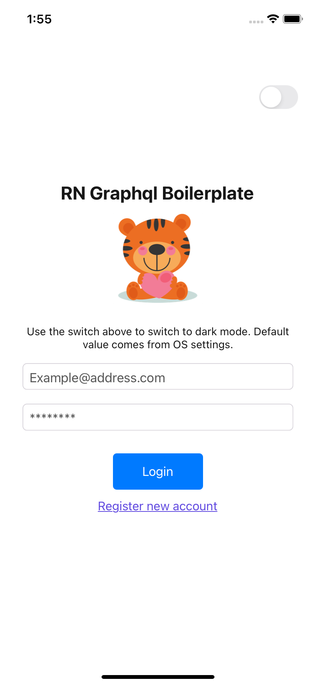
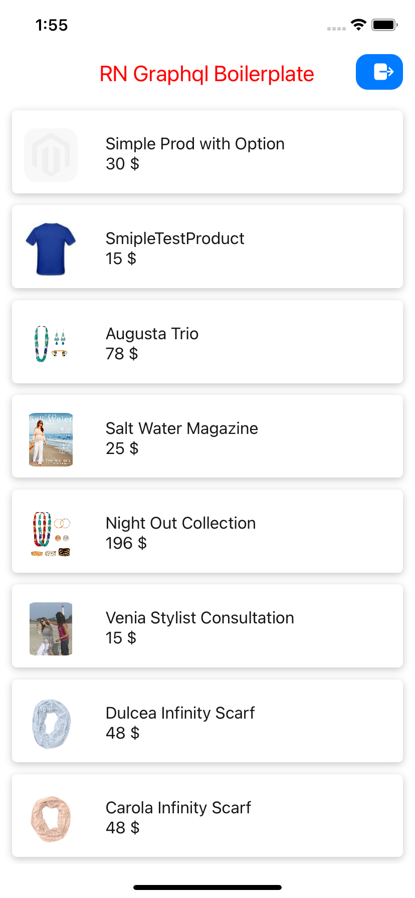

# React Native TypeScript Apollo Graphql Boilerplate

<div align="center">
  
</div>

> ### 📘 Some libraries use in this boilerplate

<div style="display: flex; flex-direction: row; align-self: center; align-items: center">
  
  
  
  
  
  
  
</div>

## 👷‍♂️ Structure
<div style="display: flex; flex-direction: row; align-self: center; justify-content: center">



</div>

## 🚀 Getting Started

### 🆒 Usage React-Native 0.65.1 & React-Navigation 6

- Create a new project using the template.

```bash
  npx react-native init MyApp --template @thiendangit1102/rn-typescript-graphql
```

- Cd into directory

```
  cd MyApp/
```

- Create .env

```
  cp .env.example .env
```

- Add to .env

```
  API_URL=<YourGraphqlApiUrl>
  DEV_SERVER_IP=<YourDevGraphqlApiUrl>
```

- Install dependencies using npm

```
  npm i or yarn install
```

- Pod install

```
  npm run pod
```

- run device

```
  npm run ios or yarn ios
  OR
  npm run android or yarn android
```
## ⚠️ React Native CLI

This template only works with the new CLI. Make sure you have uninstalled the legacy `react-native-cli` first (`npm uninstall -g react-native-cli`) for the below command to work. If you wish to not use `npx`, you can also install the new CLI globally (`npm i -g @react-native-community/cli` or `yarn global add @react-native-community/cli`).

If you tried the above and still get the react-native-template-react- native-template-typescript: Not found error, please try adding the `--ignore-existing` flag to [force npx to ignore](https://github.com/npm/npx#description) any locally installed versions of the CLI and use the latest.

Further information can be found here: https://github.com/react-native-community/cli#about

