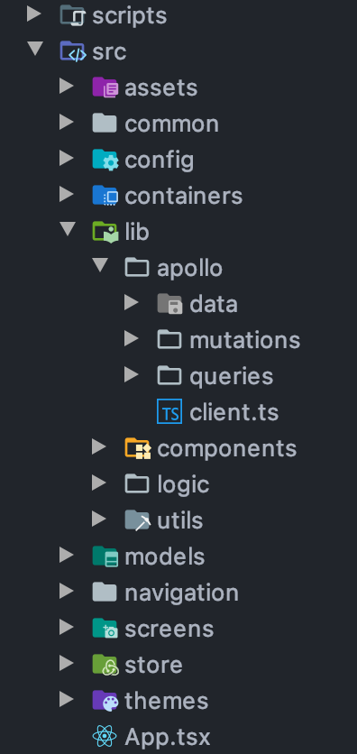

<div align="center">
  
</div>

# React Native TypeScript Graphql Boilerplate

> ### Some libraries use in this boilerplate

<div align="center">
  
  
  
  
  
  
</div>

## Structure



## Usage

1. Clone repository

```
  git clone https://github.com/thiendangit/react-native-typeScript-graphql-boilerplate.git
```

2. Cd into directory

```
  cd react-native-typeScript-graphql-boilerplate/
```

3. Create .env

```
  cp .env.example .env
```

4. Add to .env

```
  API_URL=<YourGraphqlApiUrl>
  DEV_SERVER_IP=<YourDevGraphqlApiUrl>
```

5. Install dependencies using npm

```
  npm i or yarn install
```

6. Pod install

```
  npm run pod
```

7. run device

```
  npm run ios or yarn ios
  OR
  npm run android or yarn android
```

 ✖ eslint --fix [FAILED]
 - quick commit : git commit -m "updating"  --no-verify
